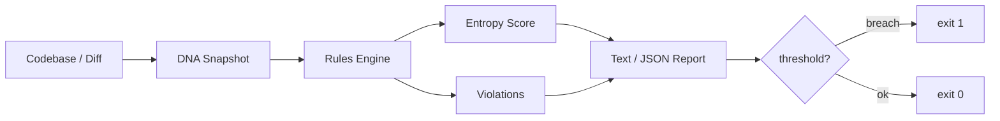

# semantic-drift-detector

[](https://github.com/medthemed/semantic-drift-detector/actions/workflows/ci.yml)

Catch architectural entropy before it compounds.

AI coding agents are excellent at *local* pattern-matching. Over many patches they
quietly erode *global* architectural intent: domain code starts importing adapters,
services reach into the UI, package boundaries blur. This tool captures an
**architectural DNA** profile from a codebase and scores structural drift on every
diff.

## Features

- **DNA snapshot** — module dependency graph, layer membership, naming rules, package roots
- **Configurable rules** — `dna.toml` / `dna.yaml` with layers, forbidden edges, required patterns
- **Entropy score (0–1)** — layer violations, naming drift, fan-out pressure, edge density
- **Diff or directory checks** — analyze a full tree or a single `git diff`
- **Batch mode** — `sdd check-batch` many roots or a manifest file in one run
- **CI-friendly** — exit code `1` when entropy exceeds threshold; JSON or human reports
- **Zero runtime deps** — Python 3.11+ stdlib only (`pytest` for tests)

## Architecture



## Install

```bash
pip install -e ".[dev]"
```

## Quick start

```bash
# Capture DNA from a project
sdd snapshot /path/to/project

# Check a directory (uses dna.toml if present, otherwise infers rules)
sdd check /path/to/project

# Check a git diff (e.g. in CI)
git diff main...HEAD > patch.diff
sdd check --diff patch.diff --dna /path/to/project/dna.toml

# Machine-readable report
sdd check /path/to/project --json

# Fail harder / softer
sdd check /path/to/project --threshold 0.15

# Named profiles from dna.toml ([profiles.strict], [profiles.relaxed], ...)
sdd check /path/to/project --profile strict

# Batch: check several roots (monorepo / multi-service)
sdd check-batch services/api services/worker libs/core

# Batch: check every path listed in a manifest (one root per line)
sdd check-batch --manifest roots.txt
sdd check-batch --manifest roots.txt --json
```

Exit codes:

| Code | Meaning |
|------|---------|
| 0 | OK — entropy at or below threshold, no error-level violations |
| 1 | Drift detected — threshold breach or error-level violations |
| 2 | Usage error |

## Batch checks

`sdd check-batch` analyzes each root independently and prints an aggregate
summary. Exit code is `1` if any root breached, `2` if any root failed to
load (missing directory / DNA), else `0`.

Manifest format (`roots.txt`):

```
# monorepo services
services/api
services/worker
# relative paths resolve against the manifest directory
../libs/core
```

Python API — the batch helpers are pure (no shared mutable state), so you
can map `check_one` across a thread or process pool:

```python
from concurrent.futures import ProcessPoolExecutor
from semantic_drift_detector import check_batch, check_one, load_manifest

report = check_batch(["services/api", "services/worker"])
print(report.ok_count, report.breached_count, report.error_count)

roots = load_manifest("roots.txt")
with ProcessPoolExecutor() as pool:
    items = list(pool.map(check_one, roots))
```

## Python API

Import from the package root. These names are the stable surface:

```python
from semantic_drift_detector import (
    analyze_directory,
    check_batch,
    check_one,
    extract_dna,
    load_manifest,
    load_profile,   # preferred name for loading dna.toml / yaml / json
    render_json,
    render_text,
    SemanticDriftError,
)

result = analyze_directory("/path/to/project")
print(result.entropy.value, len(result.errors))

profile = load_profile("/path/to/project/dna.toml")
```

Typed exceptions (each also subclasses the historical builtin so existing
`except FileNotFoundError` / `except ValueError` code keeps working):

```
SemanticDriftError
├── DirectoryNotFoundError          (also FileNotFoundError)
└── DnaProfileError
    ├── DnaFileNotFoundError        (also FileNotFoundError)
    └── InvalidDnaError             (also ValueError)
```

## Example `dna.toml`

A minimal profile you can commit at the repo root (hand-edit `rules`; the
`[[modules]]` / `[[edges]]` sections are rewritten by `sdd snapshot`):

```toml
# Architectural DNA profile
project_root = "/path/to/myapp"

[rules]
entropy_threshold = 0.25
allowed_roots = ["myapp"]
required_patterns = ["**/domain/**", "**/adapters/**"]
exclude = ["**/migrations/**", "**/generated/**"]

[[rules.layers]]
name = "domain"
prefixes = ["myapp.domain"]

[[rules.layers]]
name = "application"
prefixes = ["myapp.application"]

[[rules.layers]]
name = "adapters"
prefixes = ["myapp.adapters"]

[[rules.layers]]
name = "interfaces"
prefixes = ["myapp.interfaces"]

[[rules.forbidden_edges]]
from_layer = "domain"
to_layer = "adapters"
reason = "domain must not depend on adapters"

[[rules.forbidden_edges]]
from_layer = "domain"
to_layer = "interfaces"
reason = "domain must not depend on delivery mechanisms"

[[rules.naming]]
kind = "module"
pattern = "^[a-z_][a-z0-9_]*$"
message = "modules must be snake_case"

# Named profiles inherit [rules] and override selected keys.
# Use with: sdd check --profile strict
[profiles.default]
entropy_threshold = 0.25

[profiles.strict]
entropy_threshold = 0.10

[profiles.relaxed]
entropy_threshold = 0.40
exclude = ["**/migrations/**", "**/generated/**", "**/protos/**"]
```

### Profiles

A `dna.toml` may define `[profiles.<name>]` sections. Each profile starts from
the base `[rules]` and overrides only the keys you set:

| Key | Effect when overridden |
|-----|------------------------|
| `entropy_threshold` | Gate becomes stricter / looser |
| `exclude` | Different skip globs per profile |
| `allowed_roots` / `required_patterns` | Different package constraints |
| `layers` / `forbidden_edges` / `naming` | Full replacement of that list |

```bash
sdd check . --profile strict    # CI / main branch
sdd check .                     # default profile (base [rules])
sdd check . --profile relaxed   # local refactoring
```

Unknown profile names exit with code `2` and list the available names.

## GitHub Actions

Drop this into `.github/workflows/architecture.yml` in your project. `sdd check`
exits `1` on drift, which fails the job.

```yaml
name: Architecture

on:
  pull_request:
  push:
    branches: [main]

jobs:
  drift:
    runs-on: ubuntu-latest
    steps:
      - uses: actions/checkout@v4
        with:
          fetch-depth: 0

      - uses: actions/setup-python@v5
        with:
          python-version: "3.12"

      - name: Install semantic-drift-detector
        run: pip install semantic-drift-detector
        # or: pip install git+https://github.com/medthemed/semantic-drift-detector.git

      - name: Full-tree check
        run: sdd check .

      - name: PR diff check
        if: github.event_name == 'pull_request'
        run: |
          git diff origin/${{ github.base_ref }}...HEAD > /tmp/pr.diff
          sdd check --diff /tmp/pr.diff --dna dna.toml
```

Tips:

- Commit `dna.toml` at the repo root so CI and local runs share the same rules.
- Use `exclude` for migrations/generated code so they never fail the gate.
- Start with a generous `--threshold` (e.g. `0.35`) and tighten once the tree is clean.
- Prefer the PR-diff check in busy repos; full-tree checks are better on main.

## Example report

```
semantic-drift-detector report
========================================
mode:         directory
dna:          /proj/dna.toml
files:        42
threshold:    0.25
entropy:      0.3120 [######------------]
errors:       2
warnings:     1

violations (3):
  ✗ (error) app.domain.order (domain) imports app.adapters.payment (adapters): domain must not depend on adapters
  ✗ (error) app.domain.billing (domain) imports app.interfaces.api (interfaces): domain must not depend on delivery mechanisms
  ! (warning) module 'BadName' violates /^[a-z_][a-z0-9_]*$/

STATUS: DRIFT DETECTED (exit 1)
```

## Configuration (`dna.toml`)

```toml
[rules]
entropy_threshold = 0.25
allowed_roots = ["myapp"]
required_patterns = ["**/domain/**", "**/adapters/**"]
exclude = ["**/migrations/**", "**/generated/**", "scripts/sandbox/*"]

[[rules.layers]]
name = "domain"
prefixes = ["myapp.domain"]

[[rules.layers]]
name = "adapters"
prefixes = ["myapp.adapters"]

[[rules.forbidden_edges]]
from_layer = "domain"
to_layer = "adapters"
reason = "domain must not depend on adapters"

[[rules.naming]]
kind = "module"
pattern = "^[a-z_][a-z0-9_]*$"
message = "modules must be snake_case"
```

`sdd snapshot` writes a complete profile including the discovered module graph.
Hand-edit the `rules` section; leave `[[modules]]` / `[[edges]]` alone (they are
regenerated on the next snapshot).

### Excluding paths

Use `exclude` to skip generated code, migrations, vendored trees, or sandbox
scripts. Patterns are POSIX globs matched against paths relative to the project
root (`*` = one path segment, `**` = any depth):

```toml
[rules]
exclude = [
  "**/migrations/**",
  "**/generated/**",
  "scripts/sandbox/*",
]
```

Excluded files are omitted from DNA extraction *and* from `sdd check` directory
scans, so they never contribute to entropy or layering violations.

## How entropy works

Entropy is a weighted sum of four normalized components (each 0–1):

| Component | Weight | Signal |
|-----------|--------|--------|
| layer | 0.45 | forbidden layer edges + required-pattern misses |
| naming | 0.20 | module/class naming convention failures |
| fanout | 0.20 | average unique outgoing imports per module |
| density | 0.15 | total import edges / modules |

The score is clamped to `[0, 1]`. Threshold defaults to `0.25`.

## Python API

```python
from semantic_drift_detector import extract_dna, analyze_directory, analyze_diff, save_dna

dna = extract_dna("src/")
save_dna(dna, "dna.toml")

result = analyze_directory(".", dna_path="dna.toml")
print(result.entropy.value, result.breached)

result = analyze_diff(open("patch.diff").read(), dna_path="dna.toml")
```

## Development

```bash
pip install -e ".[dev]"
pytest
pytest --cov=semantic_drift_detector
```

## License

MIT — see [LICENSE](LICENSE).
